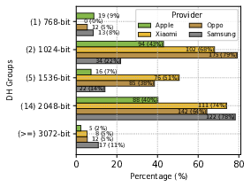

# Client Side Configuration Extraction

This README file contains the instructions for the client-side parameter analysis (Section 5).
The instructions for the server side evaluation (Section 6) can be found in the README file of the [server-side](../server-side) subdirectory.
More details on the VoWiFi Provisioning Ecosystem can be found in Section 2.7 of the paper.

> All the files necessary to reproduce the results for the paper are present in [dumps.zip](dumps.zip).
> For verbosity we included the tools and commands that were used to extract them.
>
> For each provider we mark the verbose steps with (V).


| Provider | VoWifi configuration through | Download & Parse                              |
| -------- | ---------------------------- | --------------------------------------------- |
| Apple    | IPCC Files                   | https://github.com/mrlnc/ipcc-downloader      |
| Oppo     | MBN Files                    | https://github.com/sbaresearch/mbn-mcfg-tools |
| Xiaomi   | MBN Files                    | https://github.com/sbaresearch/mbn-mcfg-tools |
| Samsung  | XML Files                    | Handset path: /system/etc/epdg_apns_conf.xml  |

All the configuration files are present in [dumps.zip](dumps.zip).

### Apple

To extract VoWifi configurations from IPCC files the following steps are necessary.

1. **(V)** Download IPCC files using ipcc-downloader.

``` bash
python3 ipcc-downloader.py -d # May take some time
for i in $(find . | grep plist); do plistutil -i $i -o $i.xml; done
```

Output can be found in `dumps/202402-01_Apple/ipcc-downloader/data/`.

IPCC URLs are stored in `ipcc_urls.txt`.

2. **(V)** From the URLs we extract providers for which iPhone Settings are present.

   `cat ipcc_urls.txt | rev | cut -d'/' -f 1 | rev | grep -i iphone | sort -u > providers.txt`

   `providers.txt` can be found under `/ipcc-downloader/providers.txt`

3. `extract_apple_ikev2_configuration_parameters.py -f dumps/202402-01_Apple/ipcc-downloader/data/ with -p providers.txt`

4. To count the used algorithms `count_apple_json.py -j apple_ike_configuration_parameters.json`

   Output stdout: IKEv2 configuration statistics.

### Samsung

1. **(V)**Extract AP (.tar.md5) file

2. **(V)** lz4: unpack super.img.lz4 to super.img [`lz4 super.img.lz4`]

3. **(V)** simg2img: unpack super.img to super.img.raw [`simg2img super.img super.img.raw`]

4. **(V)** lpunpack: extract system image from super.img.raw [`python3 lpunpack.py --partition=system super.img.raw extracted`]

5. **(V)** Mount extracted/system and go to /system/etc/

   1. `system/etc/epdg_apns_conf.xml`: contains epdg endpoints and cipher configuration

6. `python3 extract_samsung_ikev2_configuration_parameters.py -s dumps/Samsung_CLientside/epdg_apns_conf.xml`

   The extracted xml we used in the paper can be found under `evaluation/SAMSUNG/epdg_apns_conf.xml`

   Output: `samsung_ikev2_conf.json`

7. To count the different algorithms you can use `evaluation/SAMSUNG/count_samsung_json.py`

   Example Call:`python3 count_samsung_json.py -j samsung_ikev2_conf.json`

   Output stdout: IKEv2 configuration statistics.

### Xiaomi + Oppo [Qualcomm]

1. **(V)** Extract ROM, go to images folder
2. **(V)** Mount NON-HLOS.bin
3. **(V)** MBN MCFG files are located at /image/modem_pr/mcfg
4. **(V)** Use https://github.com/sbaresearch/mbn-mcfg-tools to further process MBN files
5. `extract_mbn_ikev2_configuration_parameters.py -f <dumps/Operator using MBN files>`
6. To count the used algorithms `count_mbn_json.py -j mbn_oppo_ikev2_configuration_parameters.json/mbn_oppo_ikev2_configuration_parameters.json`

   Output stdout: IKEv2 configuration statistics.


### Visualizations

These scirpts require count* stdout statistics to be manually updated inside the visualizations scripts if changes occur. If this step has to be repeated, further adaptations are suggested: (1) the count scripts to store the output in a file and (2) adapt the visualization scripts such that the input is taken from a file.

##### DH Groups (visualizations/dh_bars)

`python3 dh_bars.py`



##### Deprecated Algorithms (visualizations/deprecated)

`python3 cdf_rekey_timers.py`


##### Rekey Timers (visualizations/rekey)

Script:`python3 cdf_rekey_hours.py`


