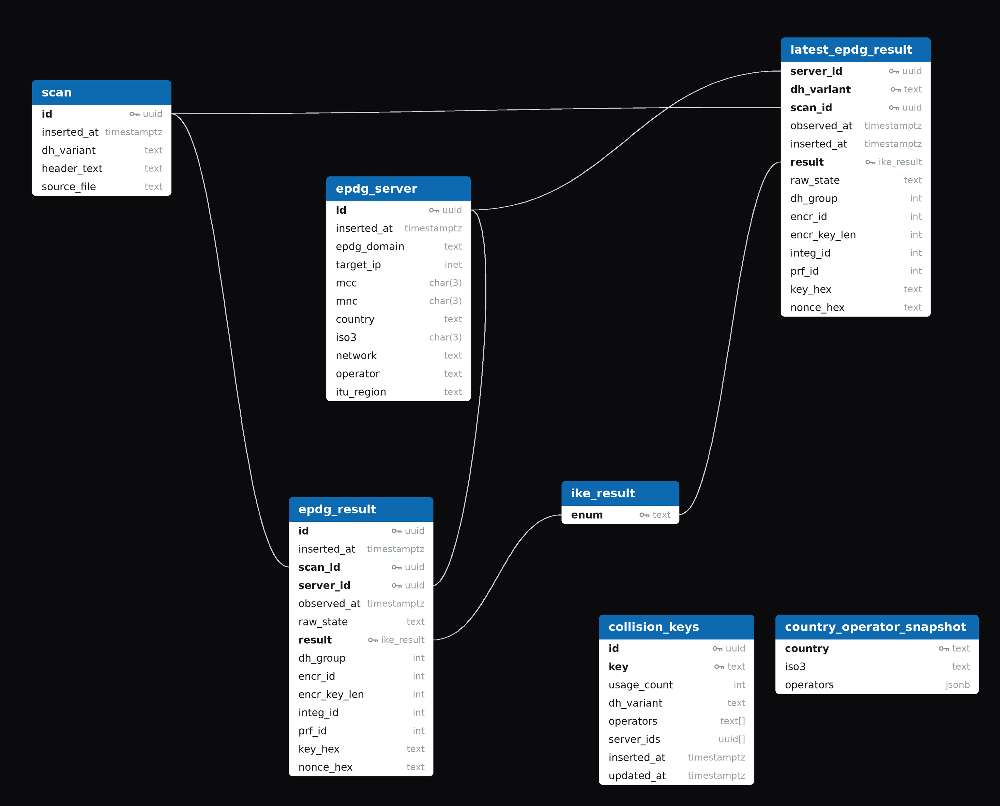

# VoWiFi Scan Automation

Automated VoWiFi ePDG discovery, scanning, storage, and visualization.

## What this Project does

This project runs an automated pipeline that discovers ePDG infrastructure and turns raw scan output into queryable data.

`apps/core/scanner/main.py` does a one-time setup first, then repeats the scan pipeline every 8 hours.

At startup, `environment_setup_check()` creates missing directories and generates baseline files when needed (the candidate ePDG domain list and `zdns` config).

Per cycle:

1. Resolve generated ePDG domains with `zdns` and write raw DNS output.
2. Filter DNS results to keep useful A/AAAA answers and valid CNAME-only domains.
3. Build the up to date ePDG target list and overwrite `epdg_domains.txt`.
4. Execute multiple first layer IKEv2 handshake test cases per target to observe behavior across DH variants.
5. Enrich discovered targets with MCC/MNC metadata (country, network, operator, ITU region).
6. Normalize and enrich scan results, then upsert into Postgres tables (`scan`, `epdg_server`, `epdg_result`).
7. Refresh latest-result snapshots (`refresh_latest_snapshot`, `refresh_country_operator_snapshot`).
8. Rebuild the key-collision dataset (`refresh_collision_keys`).
9. Cache databse takouts as sql dump and CSV files, compressed and ready to serve for download.
10. Compress older raw DNS files, keep the newest one uncompressed, then wait for the next cycle.

## Services (Docker Compose)

- `epdg-scanner`: orchestrates DNS + scan pipeline (`scanner.main`)
- `postgres`: primary data store
- `api-backend`: FastAPI (`/api/v1/*`)
- `key-collision-zulip-bot`: Zulip bot (built from `apps/bot`) that reports IKEv2 key collisions; reads from the API (`API_ORIGIN=http://api-backend:8000`) and Postgres. No host port.
- `adminer`: database UI on `127.0.0.1:8080`
- `frontend`: multi-page static site (map, table, collisions chart, database download) on `127.0.0.1:8081`

API backend is exposed on `127.0.0.1:8000`.

## Quick Start

1. Create your secrets file:

```bash
cp .env.secrets.example .env.secrets
```

2. Populate your secrets in `.env.secrets`:

- **Required** (Postgres): `POSTGRES_HOST`, `POSTGRES_PORT`, `POSTGRES_USER`, `POSTGRES_PASSWORD`, `POSTGRES_DB`
- **Required** (API DB connection): `DATABASE_URL` (or `DATABASE_URL_FILE`)

- Required only if running the Zulip bot (will gracefully exit if not set): `ZULIP_SERVER_URL`, `ZULIP_BOT_EMAIL`, `ZULIP_BOT_API_KEY`
- Optional (API behavior): `ENABLE_DOCS`, `DEFAULT_LIMIT`, `MAX_LIMIT`, `API_KEY` (or `API_KEY_FILE`), `ENABLE_RATE_LIMIT`, `RATE_LIMIT_REQUESTS_PER_MINUTE`, `RATE_LIMIT_TIMEOUT_SECONDS`, `LOG_LEVEL`
- Optional (API metadata): `APP_NAME`, `APP_VERSION`, `API_V1_PREFIX`
- Optional (DB pool tuning): `DB_POOL_SIZE`, `DB_MAX_OVERFLOW`, `DB_POOL_TIMEOUT_SECONDS`, `DB_POOL_RECYCLE_SECONDS`, `DB_SLOW_QUERY_MS`

> [!NOTE]
> The frontend calls the API with the same `API_KEY`, which is currently embedded in the frontend JS. If you set `API_KEY`, also update it at the top of `apps/frontend/static/js/map.js`, `table.js`, `collisions.js` and `takeout.js`.

3. Build and start:

```bash
docker compose build
docker compose up
```

> [!NOTE]
> Persistent data is stored under `./epdg-container/` (scanner data + postgres volume + cached takout download).

4. Analyze the data via the web frontend at `127.0.0.1:8081` or via adminer at `127.0.0.1:8080`.

## Database



## API Overview

Base path: `/api/v1` (all `/api/v1` routes require the API key).

Main route groups:

- /servers
- /scans
- /results
- /latest-results
- /all-results (paginated historical scan results)
- /map
- /collisions-latest (latest key-collision data)
- /collision-keys (collision keys ordered by usage count)
- /takeout

## Disclaimer

This project uses third-party tools and data sources:

- Natural Earth country boundaries (`apps/frontend/static/ne_50m_admin_0_countries.json`): https://github.com/martynafford/natural-earth-geojson
- DNS scanning tool (`zdns`): https://github.com/zmap/zdns
- MCC/MNC enrichment sources: [mcc-mnc.com](https://mcc-mnc.com/) and [Wikipedia mobile network code pages](https://en.wikipedia.org/wiki/Mobile_network_codes)

Please follow the upstream project license and terms when using or redistributing it.